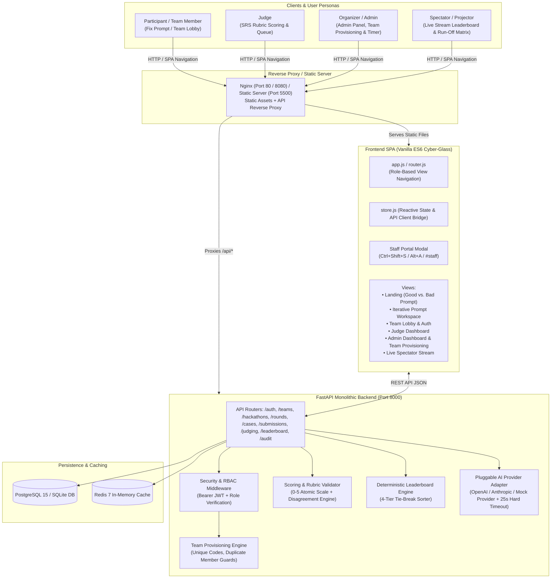

# NEURA — Prompt Engineering Hackathon Platform
> **Production-Ready, Cyber-Glass Digital Platform & Evaluation Engine for Live Prompt Engineering Tournaments**

---

## 1. Executive Summary & Purpose

**NEURA** is an end-to-end hackathon operating system and real-time digital evaluation engine purpose-built for hosting competitive prompt engineering tournaments. Engineered strictly against the authoritative Software Requirements Specification (`prompt-engineering-hackathon-platform-SRS.md`), NEURA powers live, high-stakes tournaments centered around the **"Fix the Prompt"** competition arena:

* **The "Fix the Prompt" Arena:** Teams receive deliberately flawed, ambiguous, or unconstrained prompts along with their degraded LLM outputs. Participating teams must analyze the underlying failure modes (such as missing schemas, contradictory length constraints, or absence of persona/role context), progressively engineer improvements across multiple versioned stages (`Original → v2 → v3 → Final`), and provide mandatory rationale explanations for every modification.
* **Evaluation & Scoring:** Evaluated by designated judges on an atomic 0–5 integer scale across four core SRS dimensions:
  1. **Diagnosis Quality:** Accuracy in identifying why the original prompt failed.
  2. **Improvement Quality:** Demonstrable, progressive refinement between iterations.
  3. **Final Output Quality:** Structure, accuracy, and adherence of the resulting output.
  4. **Documentation Clarity:** Legibility and transparency of the stated iteration rationale.
* **Architecture:** Engineered as a high-performance **Modular Monolith** with a **FastAPI (Python 3.10+)** backend, **SQLAlchemy 2.0**, **PostgreSQL / SQLite**, **Redis**, and a **Vanilla ES6 Cyber-Glass SPA Frontend** (sub-second load times, zero build steps, zero bundle overhead).

---

## 2. System Architecture & High-Level Topology



---

## 3. Project Directory Tree & File Inventory

```
11 SEPt/
├── index.html                                 # Primary SPA cyber-glass container & navigation shell
├── nginx.conf                                 # Nginx reverse-proxy & compression configuration
├── docker-compose.yml                         # 5-service production container composition
├── pytest.ini                                 # Pytest root configuration
├── hackathon_platform.db                      # Development SQLite database instance
├── prompt-engineering-hackathon-platform-SRS.md # Comprehensive 1,180-line SRS specification
├── README.md                                  # Complete system documentation (this file)
│
├── assets/
│   └── neura-logo.jpg                         # Official NEURA circular emblem
│
├── styles/
│   ├── neura-core.css                         # Design tokens, cyber typography, reset & base layout
│   └── neura-components.css                   # Glassmorphic panels, bracket frames, timers, modal & forms
│
├── js/
│   ├── app.js                                 # SPA bootstrap, particle generator, and server timer loop
│   ├── router.js                              # View controller, role-based navigation & staff modal triggers
│   ├── store.js                               # Local state store, seed data, API bridge, and leaderboard calculator
│   ├── ai-provider.js                         # Client-side AI execution adapter & token counter
│   └── views/
│       ├── landing-page.js                    # Landing Briefing: "Good Prompt vs. Bad Prompt" comparison
│       ├── round1-workspace.js                # "Fix The Prompt" iterative workspace, test console & versioning
│       ├── auth-team.js                       # Team Lobby: create/join teams, member roster & status locks
│       ├── judge-dashboard.js                 # Judge evaluation queue & atomic 0-5 SRS rubric scoring
│       ├── admin-dashboard.js                 # Admin Control: Team Provisioning, timers, cases & publishing
│       └── spectator-view.js                  # Live spectator stream: official leaderboard & runoff matrix
│
└── backend/
    ├── Dockerfile                             # Multi-stage Python 3.10 slim container build
    ├── requirements.txt                       # Backend dependencies (FastAPI, SQLAlchemy, Pytest, etc.)
    ├── run.py                                 # Local development Uvicorn runner
    ├── pytest.ini                             # Backend-specific pytest configuration
    └── app/
        ├── main.py                            # FastAPI application factory, middleware, router mounting
        ├── config.py                          # Settings, JWT secret, database connection URLs
        ├── database.py                        # SQLAlchemy engine, SessionLocal, declarative base, auto-seeding
        │
        ├── models/                            # Relational Database Models (SQLAlchemy 2.0)
        │   ├── user.py                        # User and Role models (RBAC: participant, judge, admin)
        │   ├── team.py                        # Team and TeamMember models
        │   ├── hackathon.py                   # Hackathon and Round models (status, timers)
        │   ├── challenge.py                   # Challenge, PromptCase, Constraint, TestCase models
        │   ├── execution.py                   # PromptVersion, Execution, Submission models
        │   ├── evaluation.py                  # Evaluation model (human judge scores & auto-scores)
        │   ├── score.py                       # Score model (per-rubric dimension values 0-5)
        │   ├── leaderboard.py                 # LeaderboardEntry cached derived view model
        │   └── audit.py                       # Immutable AuditLog model
        │
        ├── schemas/                           # Pydantic Schemas & DTOs
        │   └── challenge.py                   # Challenge schemas with participant serializer isolation
        │
        ├── core/                              # Core Domain Business Logic & Security
        │   ├── security.py                    # Password hashing (salted SHA-256) & JWT token handling
        │   ├── rbac.py                        # Dependency injection for user auth & role verification
        │   ├── token_counter.py               # Authoritative server-side BPE tokenizer heuristic
        │   ├── validators.py                  # Constraint validators (max_tokens, zero_shot, json, etc.)
        │   ├── ai_adapter.py                  # Provider-agnostic LLM execution adapter (timeout, retry, mock)
        │   ├── scoring.py                     # Rubric scoring validation, disagreement detection, leaderboard engine
        │   └── audit.py                       # Centralized audit logging helper
        │
        ├── api/                               # REST API Endpoints (Version 1)
        │   ├── auth.py                        # User registration, login, JWT token issuance
        │   ├── users.py                       # User profile retrieval
        │   ├── teams.py                       # Team creation, invite codes, lock, and admin provisioning
        │   ├── hackathons.py                  # Hackathon CRUD, competition management, server timer
        │   ├── cases.py                       # Broken-prompt cases, prompt versioning, explanation enforcement
        │   ├── challenges.py                  # Extensible challenge & constraint endpoints
        │   ├── submissions.py                 # Final prompt submissions & execution runner
        │   ├── executions.py                  # On-demand scratchpad prompt execution
        │   ├── judging.py                     # Judge assignment queue, submission inspection, rubric scores
        │   ├── leaderboard.py                 # Ranked leaderboard, publication gating, CSV export
        │   └── audit.py                       # Audit log inspection (Admin only)
        │
        ├── workers/
        │   └── execution_worker.py            # Asynchronous daemon worker for queue processing
        │
        └── tests/                             # Exhaustive Automated Test Suite (41 Passing Tests)
            ├── conftest.py                    # Pytest SQLite in-memory fixtures, clients, seed data
            ├── test_admin_team_registration.py# 8 tests: Admin team provisioning, duplicates, limits
            ├── test_ai_adapter.py             # 4 tests: LLM execution, timeout, transient retry, safety filter
            ├── test_auth.py                   # 1 test: User registration & JWT token generation
            ├── test_concurrency_and_runoff.py # 1 test: 20-team concurrent runoff & duplicate rejection
            ├── test_e2e_dry_run.py            # 1 test: Complete platform end-to-end tournament dry run
            ├── test_execution_worker.py       # 1 test: Asynchronous background execution worker
            ├── test_judge_security_contract.py# 1 test: Judge view information-hiding contract
            ├── test_judging_rubric.py         # 1 test: Atomic 0-5 integer rubric scoring validation
            ├── test_leaderboard_tiebreak_and_gating.py # 1 test: Publication gating (403) & 4-tier tie-breaking
            ├── test_multi_judge_and_disagreement.py    # 1 test: Multi-judge scoring & >=2.0 pt divergence flag
            ├── test_prompt_fixing_arena.py    # 9 tests: Fix-The-Prompt arena sessions, bank, scoring, locks
            ├── test_rbac.py                   # 1 test: Negative RBAC authorization tests across roles
            ├── test_round1_flow.py            # 1 test: Prompt iteration, explanation validation, final lock
            ├── test_round2_flow.py            # 1 test: Constraint evaluation & automated test runner
            ├── test_security_gate.py          # 1 test: Hidden test honeypot probe & serializer isolation
            ├── test_teams.py                  # 1 test: Team creation, invite codes, start lockout
            ├── test_timer.py                  # 1 test: Server-authoritative timer countdown & expiry
            └── test_validators.py             # 6 tests: max_tokens, zero_shot, one_shot, no_system, JSON
```

---

## 4. Tournament Concepts & Competition Mechanics

### "Fix the Prompt" Tournament Structure
1. **Broken Case Ingestion:**
   * Teams analyze real-world broken prompt cases with designated root failure causes:
     - `no_format_specified`: Output lacks downstream parseable structure (e.g. returns prose instead of JSON).
     - `contradictory`: Impossible constraints (e.g., summarize 10 historical events in under 20 words across 3 bullets).
     - `vague`: Ambiguous instructions lacking objective, angle, or target audience.
     - `no_role_context`: Model lacks domain persona or operational guidelines.
     - `missing_edge_cases`: Prompt fails on unexpected inputs or edge scenarios.
2. **Iterative Engineering Workflow:**
   * Teams write progressive prompt iterations: `Original (v1) → v2 → v3 → Final`.
   * **Mandatory Explanation Rule (FR-041):** Every prompt iteration MUST include a non-empty rationale explaining the modification. Submissions without explanations are rejected with `HTTP 422 Unprocessable Content`.
   * Real-time testing via the prompt execution scratchpad against the AI adapter.
   * Lock final submission before the competition timer expires.
3. **Official SRS Rubric (Scale 0–5 Integer):**
   * **`diagnosisQuality` (0–5):** Did the team accurately diagnose why the original bad prompt failed?
   * **`improvementQuality` (0–5):** Is each iteration a meaningful, explainable enhancement?
   * **`finalOutputQuality` (0–5):** Does the final output demonstrate structural clarity and quality?
   * **`documentationClarity` (0–5):** Could an outside engineer understand the iteration logic?
4. **Admin Team Onboarding & Provisioning:**
   * Organizers can register and provision teams directly from the Admin Panel.
   * Enforces 1 to 4 members per team with designated Team Leader.
   * Automatically generates distinct invite codes (`NR-XXXX`) and credentials.
   * Server validates against duplicate team names and prevents any member from being assigned to multiple teams.

---

## 5. Security Architecture & System Guardrails

1. **Role-Based Access Control (RBAC):**
   * **Participants:** Restricted to the Landing Page, Fix The Prompt Workspace, and Team Lobby.
   * **Judges:** Access the Judge Evaluation Dashboard and Live Spectator Stream.
   * **Admins:** Full access to Admin Panel, Team Provisioning, Timer Manager, Case Authoring, and Spectator Stream.
2. **Discreet Staff Login Portal:**
   * Unadvertised modal for judges and organizers, accessible via:
     - Keyboard Shortcut: `Ctrl + Shift + S` or `Alt + A`
     - URL Hash: `#staff`
   * Prevents participants from seeing judge/admin login buttons in primary public views.
3. **Information-Hiding & Serializer Isolation:**
   * Diagnostic root causes (`broken_reason`) and hidden test cases are stripped from participant responses via dedicated Pydantic schemas.
   * Direct queries to protected resources return `404 Not Found` to prevent honeypot reconnaissance.
4. **Atomic 0–5 Integer Rubric Validation:**
   * Judge evaluations strictly enforce integers between 0 and 5. Out-of-bounds, fractional, or non-numeric inputs are rejected with `HTTP 422`.
5. **Multi-Judge Divergence Detection:**
   * When multiple judges score the same submission, score deltas $\ge 2.0$ points automatically trigger a `disagreement_flag = True` alert in the audit log for organizer review.
6. **Publication Gating:**
   * Official standings are gated until explicitly released by the Admin. Pre-publication inspection requests return `HTTP 403 Forbidden`.
7. **Deterministic 4-Tier Tie-Breaking Algorithm:**
   * Ties are resolved using a deterministic hierarchy:
     1. **Total Points** `DESC`
     2. **Total Cases Solved** `DESC`
     3. **Average Evaluation Score** `DESC`
     4. **Earliest Final Submission Timestamp** `ASC`

---

## 6. Complete REST API Reference

All backend endpoints are versioned under `/api/v1`.

| Module | Method | Endpoint | Access / Role | Description |
|---|---|---|---|---|
| **Auth** | `POST` | `/auth/register` | Public | Register participant user account |
| **Auth** | `POST` | `/auth/login` | Public | Authenticate user & issue Bearer JWT |
| **Auth** | `POST` | `/auth/logout` | Public | Invalidate active session |
| **Users** | `GET` | `/users/me` | Authenticated | Retrieve authenticated profile & roles |
| **Teams** | `POST` | `/teams` | Authenticated | Create a team (creator becomes leader) |
| **Teams** | `POST` | `/teams/join` | Authenticated | Join team via invite code (`NR-XXXX`) |
| **Teams** | `GET` | `/teams/{id}` | Authenticated | Retrieve team details & active roster |
| **Teams** | `POST` | `/teams/{id}/lock` | Team Leader / Admin | Lock team roster against edits |
| **Teams** | `POST` | `/teams/admin-register` | Admin Only | Provision team (1–4 members, auto-codes) |
| **Hackathons** | `POST` | `/hackathons` | Admin Only | Create hackathon event |
| **Hackathons** | `GET` | `/hackathons/{id}` | Public | Retrieve hackathon details |
| **Hackathons** | `POST` | `/hackathons/{id}/rounds` | Admin Only | Initialize competition stage |
| **Hackathons** | `POST` | `/rounds/{id}/start` | Admin Only | Start competition timer & lock teams |
| **Hackathons** | `POST` | `/rounds/{id}/pause` | Admin Only | Pause competition timer |
| **Hackathons** | `POST` | `/rounds/{id}/end` | Admin Only | Conclude competition stage |
| **Hackathons** | `GET` | `/rounds/{id}/timer` | Public | Read server-authoritative timer |
| **Cases** | `POST` | `/rounds/{id}/prompt-cases` | Admin Only | Author new broken-prompt case |
| **Cases** | `GET` | `/prompt-cases/{id}` | Authenticated | Retrieve case (participant-safe serializer) |
| **Cases** | `POST` | `/challenges/{id}/prompt-versions` | Participant | Add iteration + mandatory explanation |
| **Cases** | `GET` | `/challenges/{id}/prompt-versions` | Authenticated | Retrieve version history |
| **Cases** | `PATCH` | `/prompt-versions/{id}/mark-final` | Participant | Designate iteration as final submission |
| **Executions** | `POST` | `/executions` | Authenticated | Test prompt in scratchpad against AI adapter |
| **Submissions**| `POST` | `/challenges/{id}/submissions` | Participant | Lock final submission |
| **Judging** | `GET` | `/judges/me/assignments` | Judge / Admin | List assigned queue submissions |
| **Judging** | `GET` | `/submissions/{id}` | Judge / Admin | View submission details |
| **Judging** | `POST` | `/evaluations/{id}/scores` | Judge / Admin | Submit atomic 0–5 rubric scores |
| **Leaderboard**| `GET` | `/hackathons/{id}/leaderboard` | Authenticated | Retrieve standings (gated until published) |
| **Leaderboard**| `POST` | `/hackathons/{id}/results/publish` | Admin Only | Publish final tournament results |
| **Leaderboard**| `GET` | `/hackathons/{id}/results/export` | Admin Only | Export official rankings as CSV |
| **Audit** | `GET` | `/audit-logs` | Admin Only | Inspect system audit trail |

---

## 7. Frontend User Experience & Design System

* **Cyber-Glass Aesthetic:** Deep space dark mode (`#05070b`) accented with cyber cyan (`#47e0ff`), electric violet (`#9a7bff`), emerald (`#4ee6a8`), and warning amber (`#ffb648`).
* **Design Elements:** Precision corner bracket frames (`.bracket-frame`), interactive glow highlights, live circular SVG timer rings, dynamic particle field, and high-contrast tables.
* **Views Catalog:**
  1. **Landing Page (`landing-page.js`):** "GOOD PROMPT vs. BAD PROMPT" visual comparison briefing illustrating the impact of persona, structure, and constraints.
  2. **Iterative Workspace (`round1-workspace.js`):** Evidence case file inspection, original bad output review, iteration editor with token counters, live test console, and submission locking.
  3. **Team Lobby (`auth-team.js`):** Participant registration, team creation, invite code sharing, and roster status monitoring.
  4. **Judge Dashboard (`judge-dashboard.js`):** Assigned evaluation queue, case tags (`CASE 01`), prompt inspection, 0–5 rubric button selectors, and judge feedback notes.
  5. **Admin Control Center (`admin-dashboard.js`):** Top metric cards, server timer manager (Start / Pause / Reset), team provisioning form, case authoring studio, and CSV/JSON export.
  6. **Live Spectator Stream (`spectator-view.js`):** Full-screen projector display showing ranked leaderboard, solved counts, case scores, and real-time evaluation matrix.

---

## 8. Automated Test Suite (41 Passing Tests)

The backend features **41 automated tests** validating every functional requirement, edge case, and security gate:

```bash
backend/app/tests/
├── test_admin_team_registration.py           # 8 tests: seeded accounts, admin register team, duplicates, member limits
├── test_ai_adapter.py                        # 4 tests: LLM execution, timeout handling, transient retries, safety filter
├── test_auth.py                              # 1 test: user registration & JWT token generation
├── test_concurrency_and_runoff.py            # 1 test: 20-team concurrent runoff & double-submission rejection
├── test_e2e_dry_run.py                       # 1 test: complete tournament lifecycle dry run
├── test_execution_worker.py                  # 1 test: background queue worker processing
├── test_judge_security_contract.py           # 1 test: judge view masks hidden test inputs/outputs
├── test_judging_rubric.py                    # 1 test: atomic 0-5 integer validation & fractional score rejection
├── test_leaderboard_tiebreak_and_gating.py   # 1 test: publication gating (403) & 4-tier tie-break verification
├── test_multi_judge_and_disagreement.py      # 1 test: multi-judge score averaging & >=2.0 pt disagreement flag
├── test_prompt_fixing_arena.py               # 9 tests: prompt bank, session generation, submission & judging
├── test_rbac.py                              # 1 test: negative authorization tests across roles
├── test_round1_flow.py                       # 1 test: prompt iteration, explanation enforcement & final lock
├── test_round2_flow.py                       # 1 test: constraint verification & hidden test runner
├── test_security_gate.py                     # 1 test: hidden test honeypot probe & serializer isolation
├── test_teams.py                             # 1 test: team creation, invite codes, round start lockout
├── test_timer.py                             # 1 test: server-authoritative timer countdown & expiry
└── test_validators.py                        # 6 tests: max_tokens, zero_shot, one_shot, no_system, JSON
```

### Running the Test Suite
```bash
cd backend
pytest -v
```
**Output:** `41 passed in ~14s` (100% passing)

---

## 9. Quick Start Guide

### Running Locally (Development Mode)

#### 1. Start the FastAPI Backend
```bash
cd backend
# Create and activate virtual environment:
python -m venv venv
# Windows:
venv\Scripts\activate
# Linux/macOS:
source venv/bin/activate

pip install -r requirements.txt
python run.py
```
* **API Server:** `http://127.0.0.1:8000`
* **Swagger Documentation:** `http://127.0.0.1:8000/api/v1/docs`

#### 2. Start the Frontend Server
From the workspace root directory:
```bash
python -m http.server 5500 --bind 127.0.0.1
```
* **Open in Browser:** `http://127.0.0.1:5500/index.html`

---

### Production Deployment via Docker Compose

Run the complete multi-container stack:
```bash
docker-compose up --build -d
```

#### Services Started:
1. **`neura_backend` (Port 8000):** FastAPI application server.
2. **`neura_worker`:** Asynchronous execution daemon.
3. **`neura_postgres` (Port 5432):** PostgreSQL 15 database.
4. **`neura_redis` (Port 6379):** Redis 7 in-memory cache and pubsub.
5. **`neura_frontend` (Port 8080):** Nginx web server & reverse proxy.

Access the production frontend at `http://localhost:8080`.

---

## 10. Default Accounts & Access Reference

### Pre-Seeded Accounts
| Role | Email | Password | Access Privileges |
|---|---|---|---|
| **Admin** | `admin@neura.io` | `admin123` | Full tournament control, team provisioning, case authoring, timer manager |
| **Judge** | `judge@neura.io` | `judge123` | Assigned submission queue, SRS rubric scoring (0–5), comments |
| **Participant** | `alex@neuralninjas.io` | `pass123` | Fix the Prompt workspace, versioning, test console, team lobby |

### Staff Portal Shortcuts
* **Keyboard Shortcut:** Press `Ctrl + Shift + S` or `Alt + A` on any view.
* **Direct URL Hash:** Navigate to `http://127.0.0.1:5500/index.html#staff`.

### Pre-Configured Teams
| Team Name | Invite Code | Status | Seeded Members |
|---|---|---|---|
| **Neural Ninjas** | `NR-4827` | Active | Alex Mercer, Elena Rostova, Kaelen Vance, Sora T. |
| **Code Warriors** | `CW-1029` | Active | David Kim, Sarah L., Marcus V. |
| **Byte Force** | `BF-3049` | Active | Priya Nair, Jonah H. |
| **Ghost Protocol** | `GP-9912` | Active | Aria Stark, Chen Wei |

---

## 11. License & Copyright
Developed for the **NEURA Global Prompt Engineering Tournament 2026**. Built in strict compliance with the authoritative Software Requirements Specification.

---

## 12. Registration Architecture (Google Form → Google Sheets → NEURA Database)

### Onboarding & Authentication Architecture Flow

```text
Google Form (External Participant Registration)
        ↓
Google Sheets (Form Responses 1)
        ↓
Registration Sync / Import Service (Google Sheets API or CSV/XLSX Upload)
        ↓
NEURA Database (PostgreSQL / SQLite Authoritative Store)
        ↓
Admin Verification & Account Provisioning
        ↓
Participant Login (PBKDF2 Hashed Passcode + Bearer JWT)
        ↓
Team Workspace & Tournament Arena
```

### Key Architectural Principles
1. **Direct Public Participant Registration Disabled**:
   - `POST /api/v1/auth/register` returns `403 Forbidden` (`{"detail": "Participant registration is managed through the official registration form."}`).
   - Public account creation forms in the frontend are removed.
2. **Database-Backed Source of Truth**:
   - Google Sheets responses are imported into the `registrations` table (`Registration` model).
   - Lifecycle states: Registration (`PENDING`, `VERIFIED`, `REJECTED`, `DISABLED`, `WITHDRAWN`) and Account (`NOT_PROVISIONED`, `ACTIVE`, `LOCKED`, `DISABLED`).
3. **Idempotent Upserts**:
   - Sync operations match records via `external_registration_id` or `email.lower()`.
   - Repeated sync runs update modified fields without duplicating users or overwriting provisioned credentials.
4. **Non-Destructive Sync Safety Guard**:
   - Rows removed from Google Sheets are flagged for review (`flagged_for_review=True`) rather than being auto-deleted.
5. **Dual Integration Modes**:
   - **Mode A — Live Google Sheets API Polling**: Service Account credentials (`GOOGLE_SERVICE_ACCOUNT_FILE` or `GOOGLE_SERVICE_ACCOUNT_JSON`).
   - **Mode B — Admin CSV / XLSX Upload Fallback**: Drag-and-drop or file selector import via Admin Control Center.
6. **Admin Registration Control Panel**:
   - Admin UI displays Google Sheets connection status, stats overview counters, upload modal, inline actions (`Verify`, `Reject`, `Provision Account`, `Reset Passcode`, `Disable`), and CSV export.

